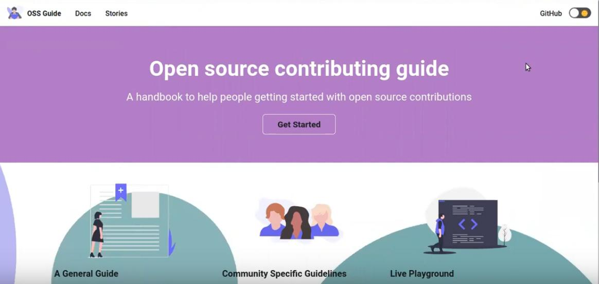
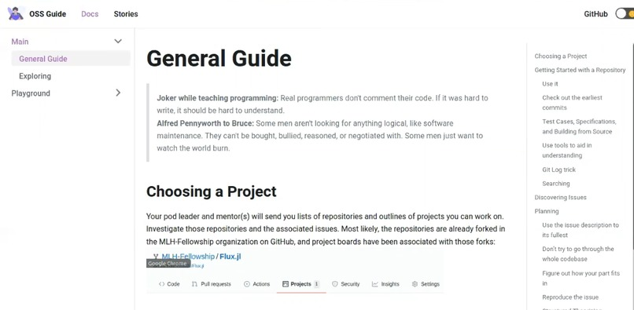
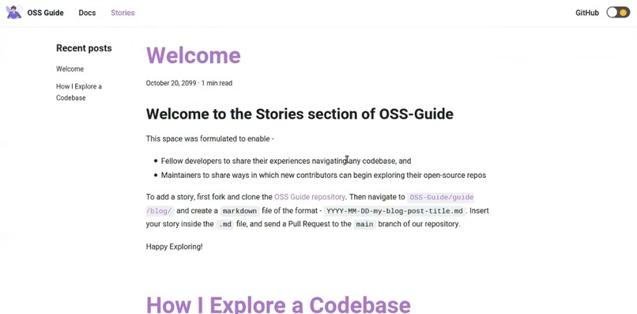
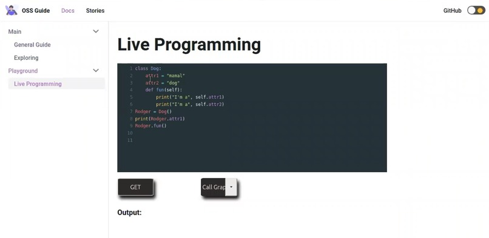

# OSS-Guide

## Motivation

Jumping into a large open-source project with no prior experience navigating such a codebase can certainly seem daunting. MLH Fellowship's Open-source track gives a platform for such budding contributors to learn and hone these skills. However, oftentimes, the beginning weeks can seem challenging and the challenge usually lies in this one question - **How to understand the large codebase of an open-source project?**

## What does this website encompass?

This handbook helps fellows out with the same. We have divided this project into 3 sections -

- **General Guide and Exploring** - This contains general information about how one can proceed to contribute to open-source. We have carefully crafted this and it presently contains the following topics -
  

  - **Choosing a Project** - How to go about selecting a project to contribute to?
  - **Getting Started with a Repository** - How to make those baby steps? Contains sub-topics like -
    - _start using it first_
    - _check out the earliest commits_
    - _read/write test cases, specifications, and build from source._
    - _wield tools such as call-graphs and UML digarams_
    - _a handy `git log` trick_
    - _searching a large codebase using Github's build-in search, grep, or ctags_
  - **Discovering issues** - How to explore a repository's issues
  - **Planning** - How should you plan your fix/feature? Contains sub-topics like -
    - _Use the issue description to its fullest_
    - _Don’t try to go through the whole codebase_
    - _Figure out how your part fits in_
    - _Reproduce the issue_
    - _Structured Theorizing_
  - **Coding and Guidance** - What to keep in mind while coding? Contains sub-topics like -
    - _Feedback from mentors and maintainers_
    - _Debugging, Logging, and Profilers_
  - **Claim an issue**
  - **Exploring** - This contains a list of interesting links regarding these very topics and also contains a _special thanks_ section.

- **Stories** - As mentioned in the _Welcome_ guide of stories section, this space was formulated to enable -

  - Fellow developers to share their experiences navigating any codebase, and
  - Maintainers to share ways in which new contributors can begin exploring their open-source repos
    

- **Playground** - Here, users can play around with code-snippets and generate UML diagrams, call graphs on the fly! We are planning to add a live debugging, profiler, and git playground.
  

## Technology

The playground backend is crafted using `Flask`. The entire frontend uses `Docusaurus - version 2` and `React`.

## Add a story

To add a story -

- First fork and clone the OSS Guide repository.
- Then navigate to `OSS-Guide/guide/blog/` and create a markdown file of the format - `YYYY-MM-DD-my-blog-post-title.md`.
- Insert your story inside the `.md` file, commit, and send a Pull Request to the main branch of our repository.

## To contribute to the general guide

To contribute -

- First fork and clone the OSS Guide repository.
- Then navigate to `OSS-Guide/guide/general.md` for general guide or `OSS-Guide/guide/resources.md` for the exploring section.
- Contribute your changes inside the above files, commit, and send a Pull Request to the main branch of our repository.

## To contribute a feature/fix

Please file an [issue here](https://github.com/MLH-Fellowship/OSS-Guide/issues).
