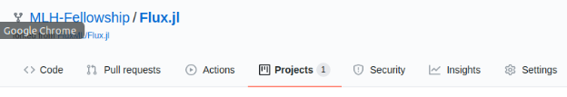

> **Joker while teaching programming:**  Real programmers don't comment their code. If it was hard to write, it should be hard to understand.  
> **Alfred Pennyworth to Bruce:** Some men aren't looking for anything logical, like software maintenance. They can't be bought, bullied, reasoned, or negotiated with. Some men just want to watch the world burn.

## Choosing a Project

Your pod leader and mentor(s) will send you lists of repositories and outlines of projects you can work on. Investigate those repositories and the associated issues. Most likely, the repositories are already forked in the MLH-Fellowship organization on GitHub, and project boards have been associated with those forks:

The project boards are a great place to start looking for issues.

If your chosen repository has not yet been forked or enriched with a project board, contact the relevant mentor, because they need to step up their game.

Alternatively, you might have a very clear vision about repositories you want to work on or work you’d like to do. Proactivity is encouraged! Make sure you open issues and discussion on GitHub in order to signal your intentions.
