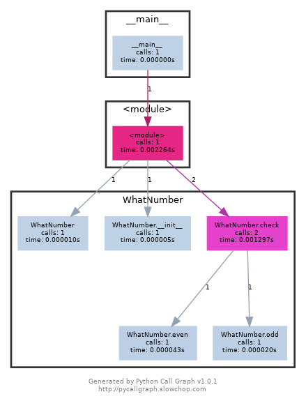
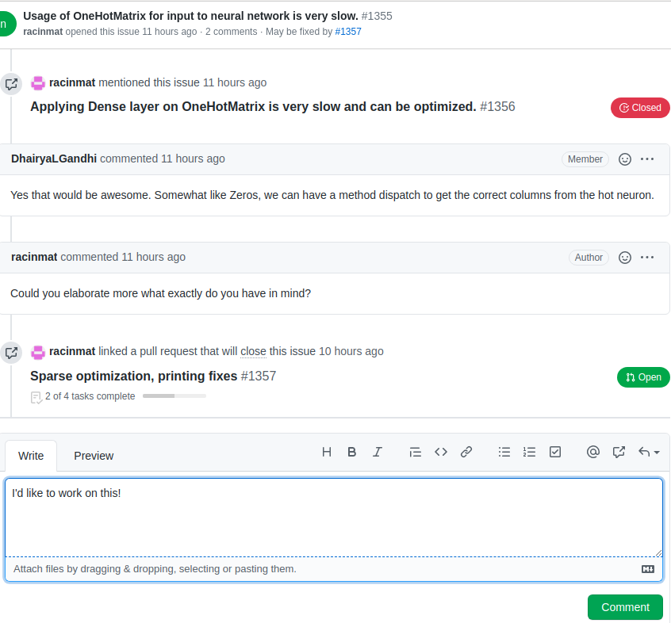

> **Joker while teaching programming:**  Real programmers don't comment their code. If it was hard to write, it should be hard to understand.  
> **Alfred Pennyworth to Bruce:** Some men aren't looking for anything logical, like software maintenance. They can't be bought, bullied, reasoned, or negotiated with. Some men just want to watch the world burn.

## Choosing a Project

Your pod leader and mentor(s) will send you lists of repositories and outlines of projects you can work on. Investigate those repositories and the associated issues. Most likely, the repositories are already forked in the MLH-Fellowship organization on GitHub, and project boards have been associated with those forks:


The project boards are a great place to start looking for issues.

If your chosen repository has not yet been forked or enriched with a project board, contact the relevant mentor, because they need to step up their game.

Alternatively, you might have a very clear vision about repositories you want to work on or work you’d like to do. Proactivity is encouraged! Make sure you open issues and discussion on GitHub in order to signal your intentions.

## Getting Started with a Repository

Exploring a new repository can certainly be a daunting task. There are many angles which come at play - familiarity with the languages, understanding of the tools or frameworks used, how components integrate with each other, what paradigm is used by the developers, etc. The points mentioned in this section will present you with approaches to make this journey smooth.

### Use it

As mentioned across various [discussion threads](https://news.ycombinator.com/item?id=16299125), the best way to get familiar with any open-source project is to use it. Begin with a very simple idea relevant to the project you are going to contribute to. Then, turn that idea into reality primarily using that open-source project. Throughout the process make sure to learn about the project’s dependencies, features, and important components/classes. Try integrating as many features as you can - remember - your first goal is to explore the breadth of this project.

If the above process takes you on a back-foot, analyze *why?* Is it because of some tool, language, framework, or something else? Once the *why* part is inspected, observe how the project is using that technology and read the documentation for the same. If documentation gets dense, jump to the tutorial or watch relevant video presentations by the authors/maintainers. If confusion persists, approach the contributors on the project’s discussion platform (Github discussion, Slack, Discord, etc).

Lastly, the primary purpose of MLH-Fellowship’s *kickoff hackathon* is to make the fellows extensively use the open-source project they are going to contribute to throughout their fellowship. So make good use of this opportunity.

### Check out the earliest commits

> Always do the hard part first. If the hard part is impossible, why waste time on the easy part? Once the hard part is done, you're home free.  
> Always do the easy part first. What you think at first is the easy part often turns out to be the hard part. Once the easy part is done, you can concentrate all your efforts on the hard part.  
> \- *A. Schapira*

Initial commits usually carry with them the entire gist of the project. By analyzing them, you can gain perspective about the initial goals of that repository.
[Here is the first commit](https://github.com/bentoml/BentoML/tree/09f4bb198f55498a46461f89bba3293a70d69373) made by BentoML maintainers on April 2, 2019. The `README` explains the three goals BentoML aims at solving - streamlining deployment workflows, major frameworks support, and devops practices built into it. This coupled with `/examples`, `/bentoml/artifacts`, and `handlers` forms a major part of their core component. Moreover, by their [48th commit](https://github.com/bentoml/BentoML/tree/5aa380fbde98f696c1b1fe1b7f514ae07368c663), they had greatly improved their documentation.

### Test Cases, Specifications, and Building from Source

> Reading test code tends to be more approachable than application code, likely because programmers don’t write tests in a hurry at 8PM  
> \- [arandr](https://arandr.github.io/2015/01/17/how-i-learned-to-stop-worrying-and-debug-other-peoples-code.html)

Transitioning from this section to *planning* can certainly be challenging. To make this switch easy, building the code from source, reading test cases, and understanding specifications can be incredibly helpful.

Testing is argued to be one of the best forms of documentation. It usually gives an idea of how authors expect things to work. Browsing the tests as example references is a great way to understand any project. If you are planning to write tests for the open-source project, MIT: 6.005 has a great [introduction to testing](https://ocw.mit.edu/ans7870/6/6.005/s16/classes/03-testing/index.html). Remember - tests are there to give you the confidence to refactor and change things freely.

If you do not already have the project cloned and running locally, ensure that this is completed before the *planning* phase. Follow the installation instructions (usually in `DEVELOPMENT.md`) on the project in order to get it running. This step is usually considered complete when you can run the test suite of the project and have all (or most) of the tests pass.

Exploring specifications is another concrete step to understand a large codebase. For example, *Runc* (a CLI tool for spawning and running containers) has documented a [`SPEC.md`](https://github.com/opencontainers/runc/blob/master/libcontainer/SPEC.md) for its `libcontainer` component - containing detailed configurations for filesystem, runtime and init process, security, etc.

### Use tools to aid in understanding

It is often useful to get a broad high-level picture of where’s what in the code, and this is where something like a UML diagram helps. Many projects include these high level architecture diagrams in their documentation, so make sure to check out if such diagrams are available.

This is because they are the most concise representation of the entire project and a good one can tell you a lot about how information is flowing across the codebase.

Your project does not have a UML diagram? Fear not, since tools exist to make combing through large codebases easier. One such tool is pyreverse, which can generate a UML class diagram of the codebase you give it automatically.

You can also get an idea of which functions are being called and in what sequence they are being called using call graphs. They are a visual representation of runtime function execution. For example -

```python
class WhatNumber:
    def __init__(self):
        self.odd_counter = 0
    def check(self, number):
        if number%2==1:
            self.odd(number)
        elif number%2==0:
            self.even(number)
    def odd(self, number):
        print("{} is odd".format(number))
        self.odd_counter += 1
    def even(self, number):
        print("{} is even".format(number))

if __name__ == "__main__":
    obj = WhatNumber()
    obj.check(2)
    obj.check(1)
```



The call graph may also contain other useful augmenting information, such as the time spent on each function call.

### Git Log trick

As mentioned in this [Hacker News thread](https://news.ycombinator.com/item?id=16299125), you can use version control to identify the most commonly edited files in any open-source codebase. These are usually the files that are doing all the work (80/20 rule) and you likely need to know of them.

The command for the same is -

```bash
# For top 10 most edited files
git log --pretty=format: --name-only | sort | uniq -c | sort -rg | head -10

# For top 50 most edited files with file_name/directory_name containing the word - <NAME>
git log --pretty=format: --name-only | sort | uniq -c | sort -rg | head -50 | grep “<NAME>”
```

## Discovering Issues

In the discovery phase, your goal is to come up with a good (written) list of issues you would like to work on. A good issue is one that:

* You are interested in working on
* Requires skills that you already have or could reasonably learn during the program

Please only look for issues within your assigned Project. MLH mentors recommend starting by searching for issues with the `help wanted`, `good first issue`, `MLH` or `hacktoberfest` labels. The mentors also recommend that you start with smaller easier issues at the beginning of the fellowship and work your way up to complex and more difficult issues throughout the program.

In conclusion, select 3 to 5 issues that meet the criteria above. Write them down in a place where you can take notes and expand upon them.

## Coding and Guidance

### Feedback from mentors and maintainers

> Another effective (debugging) technique is to explain your code to someone else. This will often cause you to explain the bug to yourself. Sometimes it takes no more than a few sentences, followed by an embarrassed "Never mind, I see what's wrong. Sorry to bother you." This works remarkably well; you can even use non-programmers as listeners. One university computer center kept a teddy bear near the help desk. Students with mysterious bugs were required to explain them to the bear before they could speak to a human counselor.  
> *B. Kernighan & D. Pike (in "The Practice of Programming" pp. 123)*

As rightly mentioned by [Arandr](https://arandr.github.io/2015/01/17/how-i-learned-to-stop-worrying-and-debug-other-peoples-code.html), it is a positive habit to talk with experienced maintainers and explain your understanding to the new contributors. Both of them involve active thinking of the codebase, and are usually faster than trying the trial-and-error strategy.

Schedule a meeting with your MLH mentor/code-maintainer to go over your plan. Come prepared to your meeting with the most detailed plans you can. A plan can ideally be a breakdown of changes, wherein a breakdown is - what are the major steps that will be needed to make this change? A good rule of thumb here is that every verb that you use should be in it’s own step.

Examples of good step breakdowns:

* Create a new class called `myApiService.js`
* Extract the code from the `getApiResponse` function in `myComponent.js` into its own class. The public methods in this class will be ...
* Write a new test to cover the case when an argument is not sent to the `xyz` function.

During the meeting, the mentor/maintainer will provide you with clarification and improvements to your plan. They may ask to improve certain aspects of your plan or move right to the acceptance phase.

### Debugging, Logging, and Profilers

> Debugging is an art that needs much further study .... The most effective debugging techniques seem to be those which are designed and built into the program itself -many of today's best programmers will devote nearly half of their programs to facilitating the debugging process on the other half; the first half... will eventually be thrown away, but the net result is a surprising gain in productivity.  
> Another good debugging practice is to keep a record of every mistake that is made. Even though this will probably be quite embarrassing, such information is invaluable to anyone doing research on the debugging problem, and it will also help you learn how to reduce the number of future errors.  
> D. Knuth (The Art of Computer Programming, Volume 1)

Debuggers are one of the strongest tools in every programmer’s arsenal. Ideally, for understanding certain function calls, you should pick a request flow, initiate a request, and let the debugger guide you through the entire request flow. When you look at different files that the debugger guides you through, you are engaging your visual memory. You will remember how the code is organized and what the files look like. For many debuggers such as `gdb` and `pdb`, the set of commands almost remains the same. As a basic necessity, you should be familiar with the following commands -

* `l` - To display lines of code from current line and below
* `p` - To evaluate the expression in the current context and print its value
* `s` - Step through the code
* `n` - Next line of code (For example: If you don’t want to run say `argsort()` and want to skip to the next line, you can use `n`)
* `q` - To quit the debugger
* `b` - Set a breakpoint (depending on the argument provided)

In some situations using a *data breakpoint* can be advantageous. Data breakpoints allow you to break execution when the value stored at a specified memory location changes. For example - watching for the change of a variable `X` to `NULL`, finding out who's releasing the memory too early and leaving back dangling pointers, observing flow when global data is accessed everywhere are some of its use cases. A more comprehensive use-case is mentioned by [Shog9 on StackOverflow](https://stackoverflow.com/questions/621535/what-are-data-breakpoints).

At this point, a frequently asked question is - **won’t a print statement suffice?**
It depends! The following answer by [Glen K. Peterson](https://softwareengineering.stackexchange.com/a/183903) excellently describes this argument - 
> For purely software problems, I find that thinking about the problem and testing the system to learn more about the problem is much more useful than stepping through code line by line. With print statements, I have a list of everything that happened at the command line or log file that I can look at and reconstruct what happened, going backwards and forwards more easily than I ever could with a debugger.  
> The hardest bugs are usually solved by understanding the problem away from the computer. Sometimes with a piece of paper or whiteboard, and sometimes the answer reveals itself while I'm doing something else. The trickiest bugs are solved by looking carefully at the code like playing Where's Waldo. All the rest seem easiest with print statements, or logging statements.  
> Different people have different styles, and different styles are better for different tasks. Print statements are not necessarily a step down from a debugger. Depending on what you are doing, they can even be better. Especially in a language that doesn't have a native debugger (does Go?).  

In situations wherein - the part of your program which fails is really large; program uses nonlinear flow control methods; is multithreaded; runs in real-time; or performs destructive actions like writing to files - a better alternative would be to use logging and assertions, as concisely [explained by slugfilter on StackOverflow](https://stackoverflow.com/a/29457171).

A detailed explanation to debugging is provided by MIT instructors - Robert Miller and Max Goldman in the [reading materials](https://ocw.mit.edu/ans7870/6/6.005/s16/classes/11-debugging/index.html) for their 6.005: Software Construction class.

Paraphrasing from [Python docs](https://docs.python.org/3/library/profile.html), Profilers provide deterministic profiling of programs. Wherein a profile is a set of statistics that describes how often and for how long various parts of the program executed. They will help you understand which parts of your program are taking most of the time and/or resources so you can focus on optimizing those parts. A brilliant guide detailing profilers is provided in [MIT’s Missing Semester](https://missing.csail.mit.edu/2020/debugging-profiling/#profiling) reading materials.

In conclusion -
> Debugging is anticipated with distaste, performed with reluctance, and bragged about forever.  

## Claiming an Issue

The maintainers of the repositories we’re working with have agreed to allocate time to support the MLH Fellows. As such, when an MLH Fellow indicates they want to work on something, the maintainers are generally happy to make sure other contributors don’t try to work on the same thing.

As such, when you decide to work on an issue, clearly state your intentions on the issue’s discussion thread:


